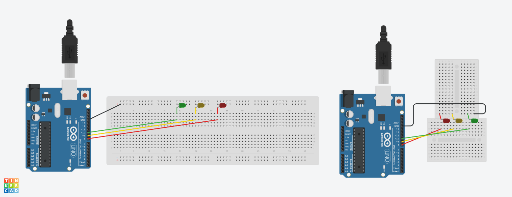
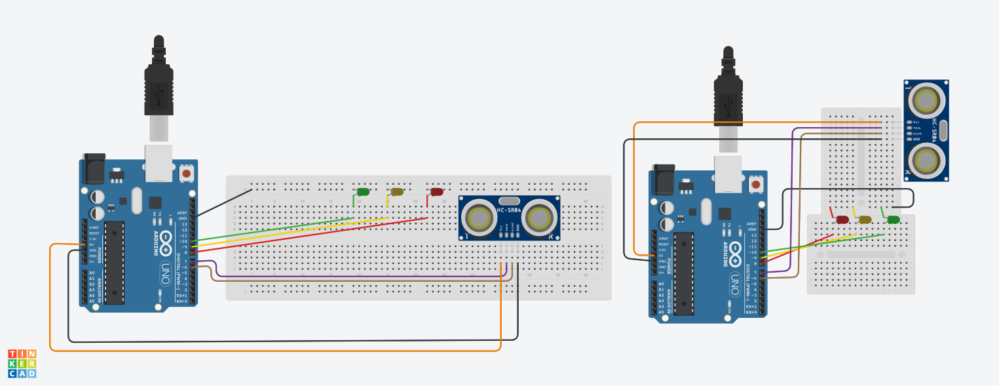
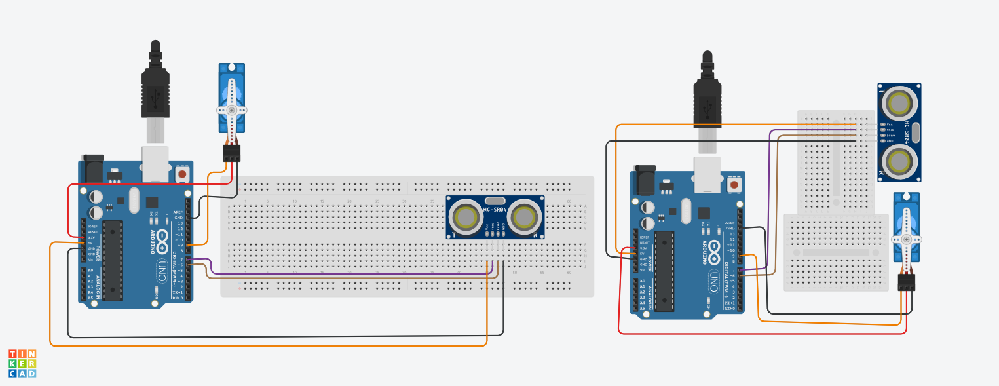

# LED



- Hijau = Pin 10
- Kuning = Pin 9
- Merah = Pin 8

```c
// Deklarasi pin LED
int ledMerah = 8;    // Pin untuk LED merah
int ledKuning = 9;   // Pin untuk LED kuning
int ledHijau = 10;   // Pin untuk LED hijau

void setup() {
  // Atur semua pin sebagai output
  pinMode(ledMerah, OUTPUT);
  pinMode(ledKuning, OUTPUT);
  pinMode(ledHijau, OUTPUT);
}

void loop() {
  // LED Merah menyala selama 2 detik
  digitalWrite(ledMerah, HIGH);  // LED merah ON
  delay(500);                   // Tunggu 0.5 detik
  digitalWrite(ledMerah, LOW);   // LED merah OFF

  // LED Kuning menyala selama 2 detik
  digitalWrite(ledKuning, HIGH); // LED kuning ON
  delay(500);                   // Tunggu 0.5 detik
  digitalWrite(ledKuning, LOW);  // LED kuning OFF

  // LED Hijau menyala selama 2 detik
  digitalWrite(ledHijau, HIGH);  // LED hijau ON
  delay(500);                   // Tunggu 0.5 detik
  digitalWrite(ledHijau, LOW);   // LED hijau OFF
}

```


# Sensor Ultrasonik



- TRIGG = PIN 7
- ECHO = PIN 6
- GND = GND
- VCC = 5V

```c
// Inisialisasi pin untuk sensor HC-SR04
const int trigPin = 7;  // Ganti dengan pin 7 untuk Trig
const int echoPin = 6;  // Ganti dengan pin 6 untuk Echo

// Variabel untuk menyimpan waktu dan jarak
long duration;
int distance;

void setup() {
  // Set trigPin sebagai output dan echoPin sebagai input
  pinMode(trigPin, OUTPUT);
  pinMode(echoPin, INPUT);
  
  // Memulai komunikasi serial
  Serial.begin(9600);
}

void loop() {
  // Pastikan trigPin LOW selama 2 mikrodetik
  digitalWrite(trigPin, LOW);
  delayMicroseconds(2);

  // Set trigPin HIGH selama 10 mikrodetik untuk memulai pengukuran
  digitalWrite(trigPin, HIGH);
  delayMicroseconds(10);
  digitalWrite(trigPin, LOW);

  // Membaca durasi sinyal HIGH pada echoPin (waktu pantulan kembali)
  duration = pulseIn(echoPin, HIGH);

  // Menghitung jarak dalam cm
  distance = duration * 0.034 / 2;

  // Menampilkan jarak di Serial Monitor
  Serial.print("Jarak: ");
  Serial.print(distance);
  Serial.println(" cm");

  // Tunggu 500 ms sebelum pengukuran berikutnya
  delay(500);
}

```

# Gabungan LED dan Sensor Ultrasonik

- Jika jarak lebih dari 20 cm, LED hijau akan menyala.
- Jika jarak antara 8 cm dan 20 cm, LED kuning akan menyala.
- Jika jarak kurang dari 8 cm, LED merah akan menyala.

```c
// Inisialisasi pin untuk sensor HC-SR04
const int trigPin = 7;  // Pin Trig untuk sensor HC-SR04
const int echoPin = 6;  // Pin Echo untuk sensor HC-SR04

// Inisialisasi pin untuk LED
const int hijau = 8;  // LED hijau
const int kuning = 9; // LED kuning
const int merah = 10; // LED merah

// Variabel untuk menyimpan waktu dan jarak
long duration;
int distance;

void setup() {
  // Atur pin sensor dan LED sebagai output dan input
  pinMode(trigPin, OUTPUT);
  pinMode(echoPin, INPUT);
  pinMode(hijau, OUTPUT);
  pinMode(kuning, OUTPUT);
  pinMode(merah, OUTPUT);
  
  // Memulai komunikasi serial
  Serial.begin(9600);
}

void loop() {
  // Pastikan trigPin LOW selama 2 mikrodetik
  digitalWrite(trigPin, LOW);
  delayMicroseconds(2);

  // Set trigPin HIGH selama 10 mikrodetik untuk memulai pengukuran
  digitalWrite(trigPin, HIGH);
  delayMicroseconds(10);
  digitalWrite(trigPin, LOW);

  // Membaca durasi sinyal HIGH pada echoPin (waktu pantulan kembali)
  duration = pulseIn(echoPin, HIGH);

  // Menghitung jarak dalam cm
  distance = duration * 0.034 / 2;

  // Menampilkan jarak di Serial Monitor
  Serial.print("Jarak: ");
  Serial.print(distance);
  Serial.println(" cm");

  // Logika untuk mengontrol LED berdasarkan jarak
  if (distance > 20) {
    // Nyalakan LED hijau, matikan LED lainnya
    digitalWrite(hijau, HIGH);
    digitalWrite(kuning, LOW);
    digitalWrite(merah, LOW);
  } else if (distance >= 8 && distance <= 20) {
    // Nyalakan LED kuning, matikan LED lainnya
    digitalWrite(hijau, LOW);
    digitalWrite(kuning, HIGH);
    digitalWrite(merah, LOW);
  } else if (distance < 8) {
    // Nyalakan LED merah, matikan LED lainnya
    digitalWrite(hijau, LOW);
    digitalWrite(kuning, LOW);
    digitalWrite(merah, HIGH);
  }

  // Tunggu 500 ms sebelum pengukuran berikutnya
  delay(500);
}


```

# Motor Servo



- MERAH = 3.3V
- ORANGE = PIN 9
- HITAM = GND

```c
#include <Servo.h>  // Mengimpor pustaka Servo

Servo servoMotor;  // Membuat objek Servo untuk mengontrol servo

int pos = 0;  // Variabel untuk menyimpan posisi servo

void setup() {
  servoMotor.attach(9);  // Menghubungkan servo ke pin digital 9 pada Arduino
}

void loop() {
  servoMotor.write(0);  // Menggerakkan servo ke posisi tertentu
  delay(1000) // Jeda 1 detik
  servoMotor.write(170);  // Menggerakkan servo ke posisi tertentu
  delay(1000) // Jeda 1 detik
}

```

# Gabungan Servo dan Sensor Ultrasonik

Saat benda ada dijarak <= 10 cm, maka servo akan berputar, lalu 2 detik kemudian akan kembali ke posisi semula

```c
#include <Servo.h>  // Mengimpor pustaka Servo

// Pin untuk sensor ultrasonik
const int trigPin = 7;
const int echoPin = 6;

Servo servoMotor;  // Membuat objek Servo untuk mengontrol servo

long duration;  // Variabel untuk menyimpan waktu perjalanan suara (dalam microsecond)
int distance;   // Variabel untuk menyimpan jarak yang diukur oleh sensor ultrasonik

void setup() {
  // Mengatur pin trigPin sebagai output dan echoPin sebagai input
  pinMode(trigPin, OUTPUT);
  pinMode(echoPin, INPUT);
  
  // Menghubungkan servo ke pin digital 9
  servoMotor.attach(9);

  // Memulai komunikasi serial (untuk debugging jika perlu)
  Serial.begin(9600);
}

void loop() {
  // Mengirimkan sinyal trigger (HIGH selama 10 mikrodetik)
  digitalWrite(trigPin, LOW);  
  delayMicroseconds(2);
  digitalWrite(trigPin, HIGH);
  delayMicroseconds(10);
  digitalWrite(trigPin, LOW);
  
  // Membaca durasi dari sinyal echo
  duration = pulseIn(echoPin, HIGH);
  
  // Menghitung jarak (kecepatan suara adalah 34300 cm/detik)
  distance = duration * 0.034 / 2;

  // Menampilkan jarak di Serial Monitor (untuk debugging)
  Serial.print("Jarak: ");
  Serial.print(distance);
  Serial.println(" cm");

  // Jika jarak di bawah 10 cm, gerakkan servo ke 170 derajat
  if (distance < 10) {
    servoMotor.write(170);  // Menggerakkan servo ke posisi 170 derajat
    delay(2000);  // Tunggu selama 2 detik
    servoMotor.write(0);  // Kembalikan servo ke posisi 0 derajat
  }

  delay(100);  // Menambahkan sedikit delay untuk menghindari deteksi terlalu cepat
}


```


